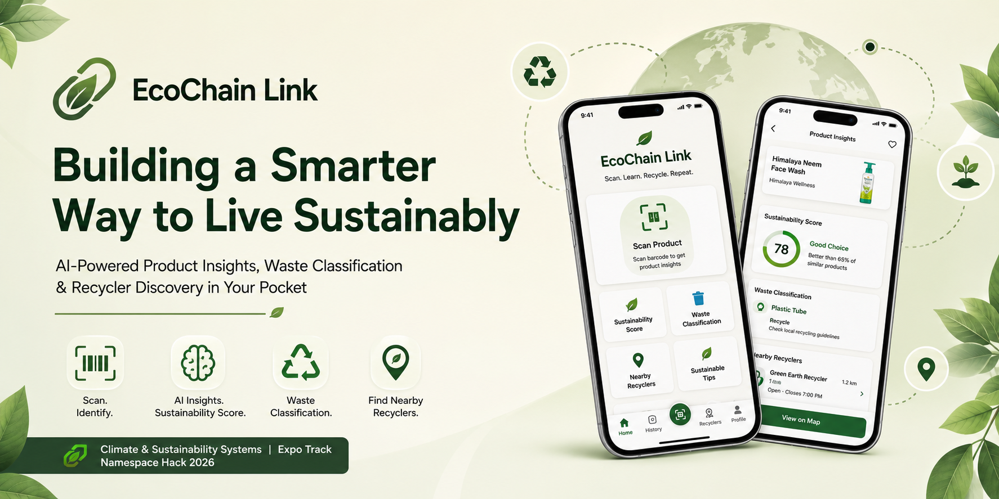

# 🌿 EcoChain Link

<div align="center">



### AI-Powered Smart Waste Management & Circular Economy Platform

Transforming everyday products into sustainable choices through AI-powered waste classification, eco-scoring, disposal guidance, and nearby recycler discovery.

---


</div>

---

# 📖 Overview

EcoChain Link is an AI-powered sustainability platform that helps users understand the environmental impact of everyday products.

Using barcode scanning, AI recommendations, environmental scoring, and recycler discovery, the application guides users toward responsible disposal while encouraging circular economy practices.

Designed with a modern mobile-first experience, EcoChain Link simplifies sustainable decision-making for everyone.

---

# ✨ Key Features

## 🔍 Smart Product Scanner

- Barcode scanning
- AI-powered product recognition
- Material identification
- Waste categorization

---

## 🤖 AI Sustainability Advisor

Powered by **Google Gemini AI**

Provides:

- Personalized disposal guidance
- Recycling recommendations
- Sustainability explanations
- Environmental insights
- Circular economy suggestions

---

## 🌱 Eco Score Engine

Every scanned product receives an environmental score based on:

- Material sustainability
- Recyclability
- Disposal impact
- Circular economy value

---

## 📍 Nearby Recycler Finder

Location-aware recycler discovery including:

- Nearby recycling centers
- Distance sorting
- Waste category support
- Contact information

---

## 📊 Sustainability Dashboard

Track your impact through:

- Total scans
- Waste categories
- Eco score trends
- Weekly sustainability insights
- Circular impact metrics

---

## 👤 Secure Authentication

- Google Sign-In
- Firebase Authentication
- Persistent login sessions
- Secure authentication flow

---

# 📱 Screens

- Splash
- Authentication
- Home Dashboard
- Barcode Scanner
- AI Advisor
- Sustainability Report
- Recycler Locator
- Profile

---

# 🏗️ Tech Stack

| Category | Technology |
|-----------|------------|
| Framework | Expo React Native |
| Language | TypeScript |
| Navigation | Expo Router |
| Authentication | Firebase Authentication |
| AI | Google Gemini 2.5 Flash |
| Storage | AsyncStorage |
| Maps & Location | Expo Location |
| Camera | Expo Camera |
| Icons | Lucide React Native |
| Animations | Moti + Reanimated |

---

# 🧠 AI Capabilities

EcoChain Link uses Gemini AI to provide:

- Product sustainability analysis
- Waste disposal recommendations
- Recycling education
- Environmental explanations
- Personalized eco-friendly alternatives

---

# 🔐 Authentication

- Google OAuth
- Firebase Authentication
- Persistent Sessions
- Secure Login Flow

---

# 📂 Project Structure

```
src/
│
├── app/
├── components/
├── hooks/
├── lib/
├── providers/
├── services/
├── types/
├── utils/
└── assets/
```

---

# 🚀 Getting Started

## Clone

```bash
git clone https://github.com/YOUR_USERNAME/ecochain-link.git
```

## Install

```bash
npm install
```

## Configure Environment

Create a `.env` file.

```env
EXPO_PUBLIC_GEMINI_API_KEY=

EXPO_PUBLIC_FIREBASE_API_KEY=
EXPO_PUBLIC_FIREBASE_AUTH_DOMAIN=
EXPO_PUBLIC_FIREBASE_PROJECT_ID=
EXPO_PUBLIC_FIREBASE_STORAGE_BUCKET=
EXPO_PUBLIC_FIREBASE_MESSAGING_SENDER_ID=
EXPO_PUBLIC_FIREBASE_APP_ID=

EXPO_PUBLIC_GOOGLE_WEB_CLIENT_ID=
```

---

## Start Development

```bash
npx expo start
```

Development Build

```bash
npx expo run:android
```

---

# 📸 Screenshots

| Home | AI Advisor | Scanner |
|------|------------|----------|
| Add Screenshot | Add Screenshot | Add Screenshot |

---

# 🎯 Problem Statement

Improper waste disposal and lack of awareness contribute significantly to environmental pollution.

EcoChain Link empowers users with intelligent guidance, making sustainable choices simple and accessible through AI.

---

# 🌍 Impact

- Promote responsible recycling
- Reduce landfill waste
- Increase sustainability awareness
- Encourage circular economy practices
- Help users make environmentally conscious decisions

---

# 📈 Future Roadmap

- Community Challenges
- Carbon Footprint Tracking
- Reward System
- NGO Integration
- Smart Collection Scheduling
- Marketplace for Recyclables
- Multilingual Support

---

# 👨‍💻 Built With ❤️

Made using

- Expo
- React Native
- Firebase
- Google Gemini AI
- TypeScript

---

# 📄 License

This project is licensed under the MIT License.

---

<div align="center">

### 🌱 Scan Smart • Dispose Better • Build a Circular Future

**EcoChain Link**

</div>